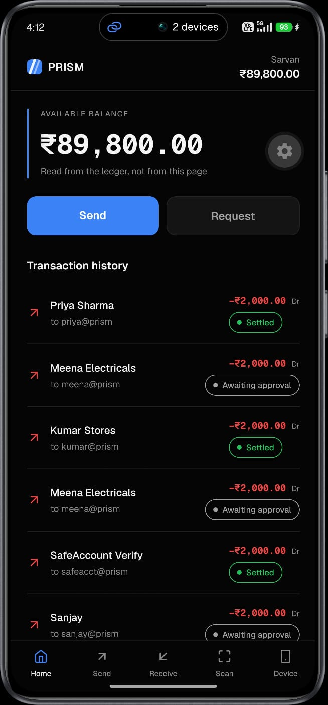

# PRISM App

The whole PRISM payment portal on a phone: sign in, balance, Cr/Dr statement,
send, review, approve, step-up, receive by QR, scan, security timeline, plus a
**device page** that answers a second-device step-up when the payment was made
on the *web* portal.

```
prism_expo_app/
  backend/    Express API on :4100 (its own server, the web stack’s database)
  frontend/   Expo Go app (React Native, no native modules, no EAS build)
```



*Home. Money out shows at every status because it is yours; money in shows only
once settled. Direction is carried by four channels: arrow, sign, Cr/Dr and
hue. Not colour alone.*

---

## Architecture

`backend/` is a **second** Express server sharing the web stack's Postgres and
Redis. It **re-implements nothing that decides whether money moves**. Intent
lock, context, risk, policy firewall, attestation chain and settlement are
imported from `../../backend/src/...` and run unchanged.

Sharing the database is the whole point: a payment made on the phone lands in
the same ledger the website reads, or the two are unrelated demos rather than
one product.

Three things are genuinely local to this server:

| File | Why it exists |
|---|---|
| `src/session.ts` | React Native's `fetch` keeps no cookie jar, so the session travels as a **Bearer token**: the *same* signed token (`keyManager.signSession`) the browser gets in its cookie. Neither surface can mint one the other would reject. |
| `src/schema.ts` | Adds one value to the `authorization_stage` Postgres enum. Kept here so the web backend's migrations and `npm run db:reset` are untouched. |
| `src/routes.ts` | Session-authed shapes of the web routes, plus `/device/pending`. |

`GET /.well-known/prism-keys` is mirrored on `:4100` because the phone only
knows one API base and still has to verify the signed step-up challenge.

---

## The constraint everything follows from

**React Native has no `navigator.credentials`.** A native passkey needs an EAS
development build *plus* `assetlinks.json` / AASA from a real HTTPS domain,
neither of which exists on `prism.local`. So a phone cannot hold a PRISM
passkey.

The substitute is one primitive:

```
code = HMAC-SHA256(device_secret, binding)
     → dynamic truncation (RFC 4226 §5.3) → % 1_000_000 → 6 digits
```

`binding` is whatever is being authorized: an intent hash for a payment, a
login challenge for a sign-in. **No time counter**: PRISM's flows already carry
an intent nonce and a TTL, so dropping it removes clock skew as a failure mode
and lets the phone derive a code with no network at all.

The same fixture is asserted on both sides. `../backend/src/modules/authenticator/otp.test.ts`
(node:crypto) and `frontend/lib/otp.test.ts` (@noble/hashes). So the two
implementations cannot silently diverge:

```
approval 944316 · denial 047685
```

### ⚠ This path is weaker than the web path, and says so

| | Passkey (`WEBAUTHN_APPROVED`) | Device code (`DEVICE_APPROVED`) |
|---|---|---|
| Key material | Private key, never leaves the device | **Shared secret**: the server has a copy |
| Bound to the transaction | Signature over the intent hash | HMAC over the intent hash |
| Tamper / replay resistance | Equal | Equal |
| Survives a server compromise | Yes | **No**: a stolen database could forge one |

Tampering and replay fail identically; **key custody does not**. So the
attestation chain records `DEVICE_APPROVED`, never `WEBAUTHN_APPROVED`, and the
timeline reads *"Approved on a paired device, not a passkey"*.
`expo-local-authentication` is a **local** check. WebAuthn carries user
verification inside the signature, this does not. So the server records
`biometricClaimed: true`, and the field is named *claimed* deliberately.

**A step-up on this phone never asks for a second code from the same secret.**
The same device answering twice proves nothing new; the server falls back to
the semantic digits quiz for accounts with no other device.

---

## Running it

The web stack must be up first: this server shares its database.

```bash
docker compose up postgres redis -d
cd backend && npm run dev                     # :4000  (web API)
cd frontend && npm run dev                    # :5173  (web portal, for pairing)

cd prism_expo_app/backend && npm run dev      # :4100  (this API)
cd prism_expo_app/frontend && npx expo start --lan
```

On the phone: **Expo Go** → *Enter URL manually* → `exp://<LAN-IP>:8081`.

**The address you give the app is the backend directly: `http://<LAN-IP>:4100`.**
Not `https://prism.local:5173`: a phone cannot resolve `prism.local` and does
not trust the mkcert CA. React Native is not subject to CORS, and with no
WebAuthn there is no secure-context requirement.

`APP_API_PORT` overrides `4100`. Everything else (Postgres, Redis, key material)
is read from the root `.env` via the imported web-backend modules.

> Restart Metro after installing any dependency. Its module map is built at
> startup, so a package added while it is running resolves as missing.

```bash
cd frontend && npm test    # the OTP fixture, tsx, no framework
```

---

## Workflow

1. **Pair from the web portal** via *Settings → Authenticator → Pair a phone*.
   The server mints the secret and draws it as a QR (`prism://pair?d=…&s=…`);
   the phone photographs it and **never sends it back**, because a secret
   POSTed over a plain-HTTP LAN is readable on the wire. Pairing is the
   bootstrap: the app has no password and no passkey.
2. **Sign in**. The server issues a random challenge, the phone answers
   `HMAC(secret, challenge)`, and the session comes back as a Bearer token.
   A login code and a payment code are derived from different bindings, so
   neither can be replayed as the other.
3. **Send**. Pick a recipient and an amount; the intent locks.
4. **Review**. Every value is re-read from `GET /payment/:id`, never from
   navigation state. *A payee carried in a route param is a payee an attacker
   can set.* The countdown is the intent lock made visible.
5. **Approve**. Biometric first, then `HMAC(secret, intent_hash)`.
6. **Step-up**, if the risk engine asks for one; then **Status** and
   **Timeline**.

Biometrics gate three things: approving a payment, re-opening the app (it locks
whenever backgrounded, because the stored secret can authorize payments), and
the destructive actions in Settings.

### Receive / Scan: where a phone beats a laptop

`Receive` mints a signed, single-use, short-lived request drawn as a QR. **The
code carries a reference, never an amount or an account**, so the payer's
server resolves it from PRISM's own records: a swapped sticker can point at an
attacker but cannot make the attacker look like the shop.

`Scan` reads one with a real camera and **locks an intent. It authorizes
nothing**. The amount and recipient come back from the server and are shown on
Review before a thumb goes down.

### The device page

A payment made on the **web portal** that needs a paired-device step-up shows a
signed QR. This phone already holds the pairing secret (signing in here *is*
being paired), so `screens/Authenticator.tsx` scans that QR, verifies the
Ed25519 signature against the cached server key, and derives the six digits
itself. No second app, no second pairing.

**The scan is the only way in.** `GET /device/pending` and a local notification
can *announce* that a step-up is waiting, but neither ever carries the
challenge: deriving a code from a token the phone was handed proves possession
of the secret and nothing more, while scanning proves this phone read the
payment off the portal, signature-verified. That is the property the ₹50,000
rule is actually buying.

---

## API (`/app/v1`, Bearer token)

| Route | |
|---|---|
| `POST /auth/challenge`, `POST /auth/login` | Paired-device sign-in |
| `GET /me`, `GET /payees`, `GET /transactions` | Account, recipients, statement |
| `GET /transactions/:id/timeline` | The attestation chain, in order |
| `GET /policy` | Thresholds the UI explains to the user |
| `POST /payment/initiate`, `GET /payment/:id` | Lock an intent, read it back |
| `POST /payment/:id/authorize` | Device code + claimed biometric |
| `POST /payment/:id/step-up/window` | Re-open the acceptance window. Buys **time, never attempts**: the wrong-code cap is a separate per-transaction Redis key |
| `POST /payment/:id/step-up` | `AUTHENTICATOR` or `SEMANTIC`, one attempt counter |
| `POST /qr/request`, `POST /qr/scan` | Receive and scan |
| `GET /device`, `GET /device/pending` | This pairing; is a web-portal step-up waiting |

Unauthenticated, on the server root: `GET /health`, `GET /.well-known/prism-keys`.

Every failure surfaces as an `ApiError` carrying the server's `failureCode`, so
screens switch on the documented catalogue instead of matching on prose. An
*unknown* code must never crash a screen: `refused (SOME_NEW_CODE)` beats a
blank page.

---

## Frontend notes

- **Navigation is a `useState` stack**, not expo-router. Ten screens and one
  back action did not justify a restructure plus a dependency.
- **`expo-notifications` is deep-imported**, not taken from the package barrel:
  the barrel registers a push-token listener at import time, which throws on
  Android in Expo Go since SDK 53 and takes the app down before first render.
  Only remote push was removed; local notifications still work. Re-check those
  paths on upgrade, and switch back to the barrel once this ships as a
  development build.
- **`lib/sim.ts` reads carrier name + MCC/MNC (not the number, IMSI, ICCID or
  IMEI)**, none of which an ordinary app can read (Android 10+ throws
  `SecurityException`; iOS never exposed the number). Carrier is far too coarse
  to identify anyone, which is exactly why collecting it is safe: its value is
  not identity, it is **change**: this phone paired on one network and is now
  on another.
- **No queued/offline payments**, matching the web portal. Intents and step-up
  windows are 60-second-lived on purpose; firing a queued payment later would
  authorize it against risk and context signals that are already stale. There
  is no local pending state to reconcile. A payment either never leaves the
  phone or the server already holds the authoritative record.
